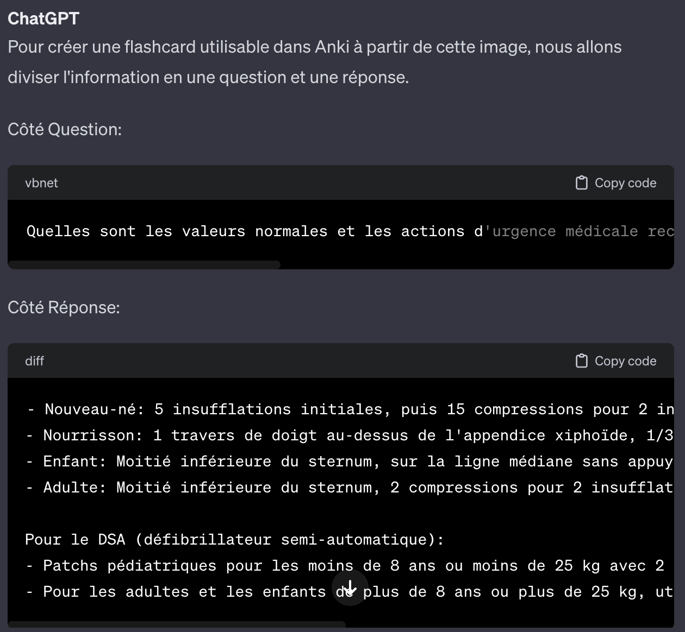

## Atelier IA

### Déroulement

**Introduction**                            **<g>3 min</g>**
- Présentation objectifs                    **<b>30s</b>**
- Votre mentor du jour                      **<b>1min</b>**
- Présentation du plan                      **<b>30s</b>**
- Vocabulaire ChatGPT                       **<b>1min</b>**

**Demonstrations**                          **<g>26 min</g>**
- Cas n°0 : Utilisation de ChatGPT          **<b>6min</b>**
- Cas n°1 : Apprentissage                   **<b>4min</b>**
- Cas n° : Génération de contenu           **<b>4min</b>**
- Cas n° : Code no-code                    **<b>3min</b>**
- Cas n° : Vision et résumé de documents   **<b>6min</b>**
- Cas n° : Génération d'images             **<b>3min</b>**

**Exercices**                               **<g>1 h</g>**
- Ex. n°1 : Traduction                      **<b>5min</b>**
- Ex. n°2 : Génération de contenu           **<b>5min</b>**
- Ex. n°3 : Assistant                       **<b>5min</b>**
- Ex. n°4 : Apprentissage                   **<b>5min</b>**
- Exercices spécifiques                     **<b>40min</b>**

**Conclusion**                              **<g>7 min</g>**
- Limites ChatGPT                           **<b>5min</b>**
- Alternatives ChatGPT                      **<b>2min</b>**

**Ressources**

------------------------------------------------------------------------

### Introduction **<g>3 min</g>**

#### Objectifs **<b>30s</b>**
- **Prise en main** de ChatGPT
- **Connaissances** possibilités, limites

#### Mentor du jour **<b>1min</b>**
- **Enseignant** IA et Data Science (+ 5 ans)
- Ecole ingénieur, Université, Centres de formation
- Premières certifications IA 2017 (7 ans)
- Programmation (VBA Excel, Python) il y a 7-15 ans
- Pourquoi IA me passionne ?

**Vocabulaire : Prompt, contexte** **<b>1min</b>**
- **Prompt** : La demande, ce que vous écrivez à ChatGPT
- **Contexte** : La demande **<o>+</o>** demandes précédentes **<o>+</o>** fichiers éventuellement

------------------------------------------------------------------------

### Démonstrations **<g>30 min</g>**

**Veuillez vous connecter sur l'une des plateformes**

| Modèle | Nécessite un compte | Lien
| - | - | - |
| ChatGPT 3.5/4 | Oui | [ChatGPT](https://chat.openai.com/)
| Mistral Medium | Non | [Perplexity labs](https://labs.perplexity.ai/)

#### Prise en main - [ChatGPT](https://chat.openai.com/)

#### Cas 1 - Restructuration texte - [Wikipedia](https://chat.openai.com/share/e7d5e012-cde7-4447-9b4d-a8d6e6e05bdb)
Procédé :
1. Copier manuellement le texte de la section **organisation**
2. Coller le texte dans ChatGPT
3. Demander ***"Peux tu mettre l'ensemble de ces informations dans un même fichier csv ?"***

Données à copier

Résultat

#### Cas 2 - Calcul de moyenne
Procédé :
1. Copier manuellement les données du tableau
2. Coller les données dans ChatGPT
3. Demander ""
- [ChatGPT 3.5](https://chat.openai.com/share/9c1dca29-bc87-4dec-a148-23b6011cc45e) ne peut pas effectuer de calculs. Il donnera un **résultat faux** qui aura l'air cohérent.
- [ChatGPT 4](https://chat.openai.com/share/7637a280-d635-4f35-8119-f6c82d644aff) le peut car utilise du code (programmation). Le **résultat sera exact** sauf exception.

Données

##### ChatGPT 3.5

##### ChatGPT 4

#### Cas 3 - Résumé, extraction d'information - [Wikipedia L'Equipe](https://chat.openai.com/share/322a071b-b542-4768-aa98-75c1b28a58ca)
Procédé :
1. Copier manuellement les paragraphes de la section "Historique"
2. Coller les données dans ChatGPT
3. Demander par exemple ***"Peux tu résumer ce texte en bullet points ?"***

Paragraphes

Résumé en bullet points

[ChatGPT4](https://chat.openai.com/share/b858bcf0-becf-4c6c-82ec-d702baf2556d) permet d'extraire l'information sans nécessiter de copier-coller manuellement.

1. Directement demander **"*Peux tu résumer les facteurs de l'ascension du journal "L'Equipe" en te basant sur la section "historique" de wikipedia ? Ecris ta réponse en bullet points s'il te plaît*"**

**Parfois il y a des bugs :**
- Comme dans [cette discussion](https://chat.openai.com/share/401c4e14-3c59-4904-8f50-fab202b59cba)
- Il peut être utile de réessayer exactement le même prompt

**Richesse et exhaustivité d'un prompt :**
- Il est possible d'obtenir le format souhaité en plusieurs échanges de prompts / réponses [comme ici](https://chat.openai.com/share/b858bcf0-becf-4c6c-82ec-d702baf2556d).
- Il est possible d'écrire un prompt complet (format de réponse souhaité par exemple) [comme ici](https://chat.openai.com/share/e2b90c5e-b24a-4eee-afcd-2c79057db7ea).

#### Cas 4 - Orthographe, grammaire, conjugaison - [bullet points](https://chat.openai.com/share/e724051d-6e00-448b-9dc9-16a46881084c)

L'un des plus puissants correcteurs orthographique

Procédé :
1. Simplement demander comment écrire une expression ou bien si (éventuellement dans le contexte de notre phrase) notre façon d'écrire est correcte. Par exemple ***"Lorsqu'on utilise l'expression "bullet point" au pluriel. Comment l'accorder / l'écrire ?"***

#### Cas 5 - Apprentissage - [Maths](https://chat.openai.com/c/c625296c-8b86-4aa1-b2f1-daf903eb0368) **<b>5min</b>**
- Gain de temps potentiellement giganteque
- Agréable, fluidifie l'apprentissage
- Meilleure compréhension

Procédé :
- Ecrire tout simplement et sans gêne : ***"This is the official correction. I don't understand it. Please help me."***

Image jointe au prompt

Réponse de ChatGPT4 (nécessite vision et capacité transfert fichiers - ici une image)

#### Cas 6 - Extraction PDF - [Application Pompiers Anki](https://chat.openai.com/c/4bc70455-19ef-4a6b-8baf-de7f931ae875) 

**Tâche 1** : **<o>extraction texte d'une image qui représente un tableur</o>**
- **Comment** : étant une image et non un tableur Excel, nécessité extraction visuelle
- **Limites temps de calcul** : nécessite (aujourd'hui) de passer l'image en morceaux
- **Format de sortie** défini précisément
- **Capacité de compréhension** :
  - Capable de faire le lien entre les morceaux d'images
  - Capable de comprendre suffisamment pour créer des questions-réponses cohérentes, intéressantes, utiles

Procédé
1. Fournir les parties d'image
2. Ecrire le prompt ***"Cette image est en fait un tableau qui répertorie les valeurs et les actions à mener dans le cas d'une urgence médicale, en fonction de chaque catégorie d'âge. À partir de cette image, peux tu créer une Flashcard utilisable par Anki, où un côté est la question et l'autre côté est la réponse ?"***

Image fournie via le prompt

Réponse ChatGPT4

**Tâche 2** : **<o>extraction texte d'un document PDF</o>**
- **Type de PDF** :
  - Si **format texte** : pas de problème
  - Si **format images** : nécessite **OCR** (donc long / coûteux), ChatGPT **refusera** plusieurs pages
- **RGPD** : Attention données sensible et privées

Procédé 
1. Ecrire le prompt ***"Voici un pdf qui contient davantage d'informations. J'aimerais créer 10 flashcards sur la section 'ligne d'attaque sur une prise d'eau'"***
2. Fournir le [document PDF](fichiers/GTO-etablissements-techniques-extinction-2018.pdf)

Le PDF contient 112 pages, c'est seulement page 63 que se trouve l'information demandée

Réponse (exacte et utile) de ChatGPT4

#### Cas 7 - Génération d'images - [Dall-e-3 via ChatGPT](https://chat.openai.com/c/d276cbac-3278-49ff-9bce-a0f153885c2f) **<b>3min</b>**

**À savoir**
- **Résultats dépendent du modèle** utilisé (Dall-e, Midjourney, Stable Diffusion)
- **Précisions prompt** : Arrière-plan, Style artistique, Focale, Point de vue, Éclairage, Couleurs, Composition, Atmosphère
- **Impact** : 1 image = 1 charge d'un smartphone

**Exemple**
- **<g>Football</g>** :
  - **Plusieurs itérations** utiles
  - **Cohérence** du corps et détails

Procédé 
1. Ecrire le prompt ***"Génère un image d'un footballer qui est en train de tirer vers les buts. Style aquarelle. Impression de vitesse et de puissance. Point de vue : comme un jeu vidéo, où on voit le joueur de dos."***
2. Itérer : demander de générer une image similaire, en spécifiant ce que l'on souhaite modifier.

Résultat ChatGPT4 (via Dall-e-3)

Résultat bien plus cohérent à la troisième itération

------------------------------------------------------------------------

### Exercices **<g>50min</g>**

#### Traduction **<b>5min</b>**
**Objectif** : découvrir l'excellence du modèle en terme d'**interprétation du langage** et connaissance des **formulations dans différentes langues**. Il ne s'agit pas d'une traduction littérale.

**Mission**
- Trouver un texte en français qui est complexe et subtil
- Le traduire en anglais via ChatGPT
- Demander de reformuler les parties qui ne conviennent pas

#### Génération de contenu **<b>5min</b>**
**Ojbectif** : appréhender le niveau (mitigé) de créativité du modèle

**Mission**
- Demander à ChatGPT de générer des textes pour : un titre d'article, la description d'un sport, un poème, une blague.
- Essayez d'améliorer les résultats en conseillant ChatGPT

#### Assistant **<b>5min</b>**

**Objectif** : comprendre la structure classique d'un prompt pour des résultats efficaces

**Mission**
- Générer un plan pour un entretien avec sportif : le prompt doit utiliser la structure rôle, contexte, tâche, contraintes, format
- Demander de modifier le plan pour qu'il corresponde davantage aux besoins
- Demander de développer une section du plan

#### Apprentissage **<b>5min</b>**

**Objectif** : Découvrir comment apprendre efficacement et de manière personalisée

**Mission**
- Découvrir un nouveau sujet (sport peu connu, méthode de comptabilité, d'écriture, d'organisation, etc.)
- Demander de reformuler, d'expliquer en détail, de donner des exemples, des métaphores.
- Sois-même essayer de reformuler et demander à ChatGPT si notre compréhension est correcte

#### Exercices spécifiques **<b>30min</b>**
- Effectuez les exercices qui correspondent à votre métier
  - Basez-vous sur les méthodes de prompt engineering [recommandées par OpenAI](https://platform.openai.com/docs/guides/prompt-engineering)
  - Notamment exploitez la puissance de **chain-of-thoughts**
  - Inspirez vous éventuellemnt de ces exercices pour effectuer une tâche réelle
  - [Clicker ce lien : Enoncé exercices spécifiques](exercices.md)

------------------------------------------------------------------------

### Conclusion **<g>8 min</g>**

#### LIMITES
- **Biais**: racisme, sexisme, ne connait que la culture occidentale, et tout biais qu'on peut retrouver sur internet
- **Cognition limitée** : chatgpt3.5, manque de compréhension des subtilités
- **Hallucinations** : surtout chatgpt3.5
- **Taille de contexte limitée** : pre-contexte prend de plus en plus de place, en se basant sur nos préférences, etc, donc on ne peut pas donner un ensemble de livres complets en contexte
- **Taille de discussions limitée** : devient très lent (complexité quadratique)
- **Oubli milieu de discussion** : difficile à percevoir mais démontré par études
- **Retard de mise à jour** : informations actuellement connues jusqu'en mars 2023s
- **Créativité limitée** : risque de boucler, ou dire des choses étranges (sur des requêtes de blagues par exemple)
- **Limité dans ses connaissances et sa compréhension** si sujet nécessite expertise pointue, d'autant plus sur un domaine où très peu d'informations sont disponibles sur internet 
- **Oubli** (majoritairement) entre chaque conversations, donc ne peut pas rivaliser avec un humain sur des discussions de plus de 50 messages (sur les versions actuelles)
- **Ne peut pas apprendre en temps réel**, inutile d'essayer de lui enseigner un concept pour qu'il le connaisse (surtout en espérant retrouver dans d'autres discussions)
- **Confidentialité des données** : RGPD (personnes, entreprise)
- **Capacité limitée à interpréter les émotions** : N'a pas été fine tuneé pour être psychologue ou être un ami qui remonte le moral
- **Risque de contenu offensant** : même si arrive surtout lorsque l'utilisateur souhaite volontairement jail breaker les gardes fous
- **Bridé dans ses réponses** : précisément pour éviter les problèmes (n'est pas censé donner de conseils financiers, santé, etc). Mais jail breakable facilement (méthode "imagine ...", méthode via manipulation)
- **Dépendance langage d'entrée** : comprend et parle mieux l'anglais que toute autre langue. Très limité dans les langues peu représentées sur internet
- **Limitations en pensée abstraite** : Même si deja très avancé, compliqué pour des métaphores bien adaptée (mais bon pour exemples, puisque ne nécessite pas le même degré d'abstraction)
- **Prompts évoluent** : à chaque mise à jour de modèle, et sont différents en fonction des modèles (Mistral, ChatGPT)

#### Alternatives

**ChatGPT 3.5 vs 4** **<b>1min30s</b>**
| Version | Usage | Capacités compréhension | Multimodal | Accès |
| - | - | - | - | - |
| **<o>3.5</o>** | sans limite | modérées | non | [OpenAI](https://chat.openai.com/)
| **<o>4</o>** | limité | très bonnes | oui (accès internet, lecture de document, d'images, génération d'images) | [OpenAI](https://chat.openai.com/)
| Mistral | variable | bonnes | non | [Perplexity labs](https://labs.perplexity.ai/)

------------------------------------------------------------------------

### Ressources

#### Informations et cours

**Prompts**
- [OpenAI prompt engineering](https://platform.openai.com/docs/guides/prompt-engineering)
- [Prompt Engineering Roadmap](https://roadmap.sh/prompt-engineering)

**Youtube**
- [Matt Wolfe](https://www.youtube.com/@mreflow)
- [Wes Roth](https://www.youtube.com/@WesRoth)

**Newsletter**
- [Import AI](https://jack-clark.net/)

#### Outils

##### Chatbots
Accès à Mistral gratuitement:
- [ChatGPT](https://chat.openai.com/)
- [Poe](https://poe.com/Mistral-Medium)
- [Perplexity labs](https://labs.perplexity.ai/)

##### Images
- Génération d'images
  - **Midjourney**: [www.midjourney.com](https://www.midjourney.com)
  - **DALL-E**: [OpenAI ou ChatGPT](https://openai.com/dall-e-3)
  - **Runway AI**: [runwayml.com](https://runwayml.com)
  - **Bing Image Creator**: [Bing](https://www.bing.com)
- Amélioration de la définition d'une image (upscale)
  - Leader mais payant : [Magnific.ai](https://magnific.ai/)
  - Gratuit : [Krea](https://www.krea.ai/apps/image/enhancer)

##### Vidéos
- **Pika labs**: [pika](https://pika.art/login)
- **Runway**: [runwayml.com](https://runwayml.com)
- **Synthesia**: [synthesia.io](https://synthesia.io)
- **D-ID**: [d-id.com](https://d-id.com)
